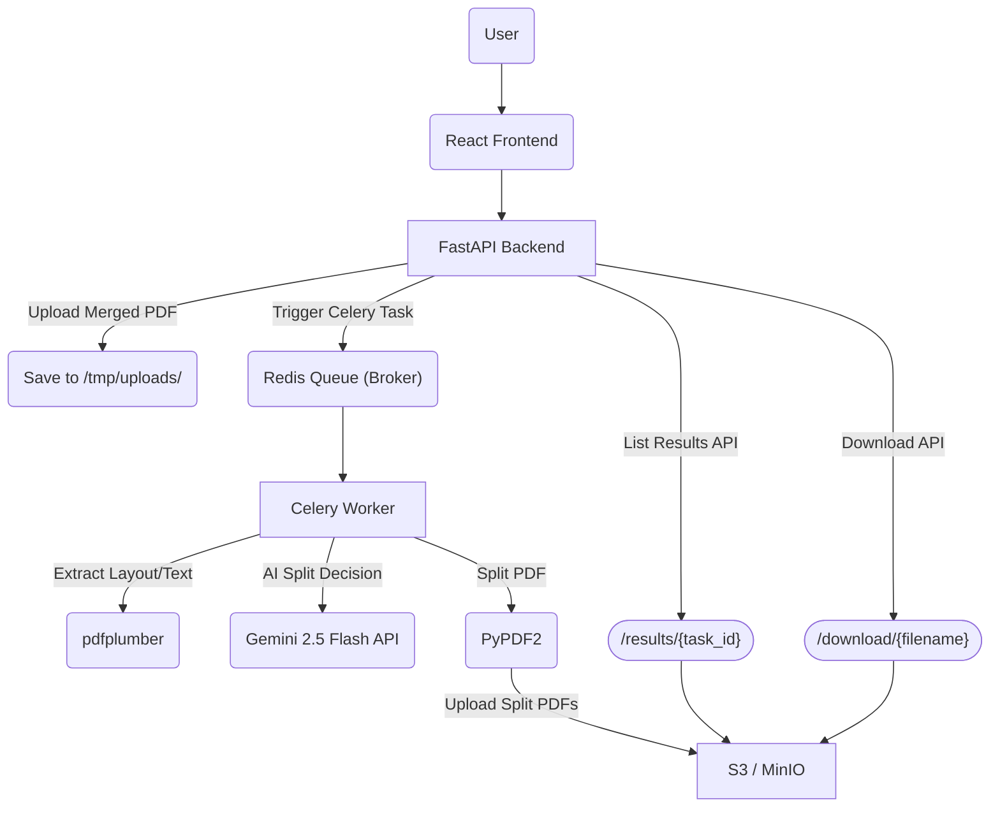

# pdf_unmerger 

The **PDF Unmerger** is an intelligent document processing system designed to:

- Upload large merged PDF files (e.g., 200+ documents)

- Automatically detect split points

- Unmerge the PDF into individual documents

- Store resulting PDFs in S3-compatible object storage

- Provide APIs for upload, status tracking, result listing, and file downloading

## Tech Stack
- **Backend**: FastAPI
- **Frontend**: Simple, interactive frontend using react.
- **Worker**: Celery with Redis
- **Logging**:  Loguru
- **Task Queue**: Redis
- **Language**: Python 3.10+
- **Dockerized**: Easily deployable using Docker Compose, which includes the necessary configuration for the backend and frontend.

## Prerequisites
- Docker and Docker Compose
- A `GEMINI_API_KEY` for query generation and/or other external services. https://aistudio.google.com/apikey
- Make sure the required ports are available during docker compose or change the port.


## Getting Started

### Step 1: Clone the Repository
Clone this repository to your local machine:

```bash
git clone https://github.com/ajaym416/pdf_unmerger.git
cd pdf_unmerger
```
### Step 2: Set Up Environment Variables
A sample .env file is included in the repository. Copy it to create your own environment configuration. Update the api key with your own Gemini api key

```bash
cp .env.sample .env
```
### Step 3: Build the Docker Containers
With Docker Compose, you can easily set up the backend and PostgreSQL database. To build the Docker containers, run the following command:

```bash
docker compose up --build
```

🌐 Access Points
🖥️ Frontend: http://localhost:3000

📘 Swagger Docs: http://localhost:8000/docs

☁️ MinIO UI: http://172.18.0.2:9000

💡 MinIO access credentials are configured via environment variables — make sure to set them properly in your .env file.


**System Architecture Diagram:**




🧑‍💻 Author
Ajay Pyatha